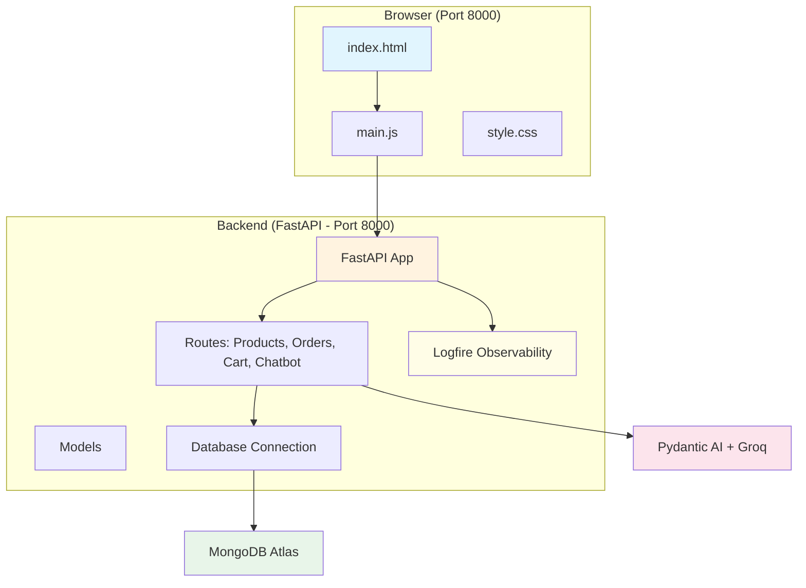

# Documentation Index

Welcome to the LUXE E-Commerce Store documentation. Think of this project like a functioning digital mall: the **Frontend** is the beautifully decorated storefront, the **Backend** is the busy warehouse manager fulfilling orders, the **Database** is the massive ledger of inventory, and our **AI Chatbot** is your personal shopping assistant!

## Quick Navigation

### 1. Project Overview
- **Purpose**: Learn about the project and all terminologies
- **File**: [01-project-overview/00-project-overview.md](./01-project-overview/00-project-overview.md)
- **Terminologies**: [00-terminologies.md](./00-terminologies.md) *(Start here if you are new!)*

### 2. Backend Documentation
| Document | Description |
|----------|-------------|
| [Overview](./02-backend/00-backend-overview.md) | Backend overview |
| [main.py](./02-backend/01-main-app.md) | Main application entry |
| [products.py](./02-backend/03-product-routes.md) | Product management + bulk generator |
| [orders.py](./02-backend/04-order-routes.md) | Order processing |
| [cart.py](./02-backend/05-cart-routes.md) | Shopping cart |
| [chatbot.py](./02-backend/06-chatbot-routes.md) | AI chatbot (Text2NoSQL) powered by Pydantic AI |
| [database.py](./02-backend/08-database.md) | Database setup |
| [models.py](./02-backend/09-models.md) | Data models |

> [!NOTE]
> Authentication has been intentionally removed for this demo. The app opens directly to the store — no login required!

### 3. Frontend Documentation
| Document | Description |
|----------|-------------|
| [Overview](./03-frontend/00-frontend-overview.md) | Frontend overview |
| [main.js](./03-frontend/01-main-js.md) | Application entry point |
| [style.css](./03-frontend/02-styling.md) | Styling guide |

### 4. Database Documentation
- [Overview](./04-database/00-database-overview.md) - MongoDB structure and collections

### 5. Models Documentation
- [Overview](./05-models/00-models-overview.md) - Data model definitions

### 6. Deployment & CI/CD
- [Deployment Guide](./06-deployment/00-deployment.md) - Architecture of Docker, ECR, EC2, and CI/CD pipelines

---

## Project Architecture



## Technology Stack

| Layer | Technology | Analogy |
|-------|------------|---------|
| Frontend | Pure Vanilla JS with Native ES Modules | The storefront directly served by the backend — no build step needed! |
| Backend Framework | FastAPI (Python) | The manager directing traffic, processing orders, and checking stock. |
| Database | MongoDB Atlas | The vast warehouse storing boxes (documents) of products. |
| AI Service | Pydantic AI + Groq (Qwen) | A hyper-intelligent virtual salesperson who queries the warehouse automatically. |
| Observability | Pydantic Logfire | The security camera watching every request in real-time. |
| Data Validation | Pydantic | A bouncer validating that all incoming data is correctly formatted. |

## API Endpoints Summary

| Method | Endpoint | Description |
|--------|----------|-------------|
| GET | `/products` | Get products (filter by `category`, `min_price`, `max_price`) |
| POST | `/products` | Add a new product (with image upload) |
| PUT | `/products/{id}` | Update a product |
| DELETE | `/products/{id}` | Delete a product |
| DELETE | `/products` | Delete all products |
| POST | `/products/bulk-generate-500` | 🚀 Auto-generate 500 demo products |
| POST | `/orders` | Place order |
| POST | `/cart/add` | Add to cart |
| GET | `/cart/{email}` | Get cart items |
| POST | `/chat` | Chat with AI assistant (Text2NoSQL) |

---

## Getting Started

### Prerequisites
- Python 3.8+
- MongoDB Atlas account (connection string in `.env`)
- Groq API Key (in `.env`)

### Running the Application

```bash
python -m venv venv
venv\Scripts\activate
pip install -r requirements.txt
python main.py
```

Open browser at `http://localhost:8000`

> [!TIP]
> After starting, navigate to **Add Products** in the navbar and click **⚡ Generate 500 Demo Products** to instantly populate the store with sample clothing!
