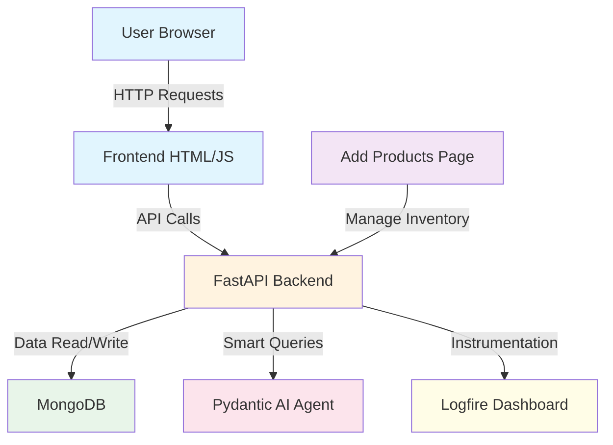

# Project Overview

## Terminologies Explained Simply

This document explains all technical terms used in this e-commerce project with easy-to-understand analogies!

### Technology Stack & Core Concepts

| Term | Simple Meaning & Analogy |
|------|-------------------------|
| **API** | Application Programming Interface. **Analogy:** It's the standard menu at a restaurant. It tells the frontend exactly what it can order from the backend. |
| **Backend** | The hidden server-side code. **Analogy:** The kitchen staff cooking the meals and managing the inventory. |
| **Frontend** | The user interface. **Analogy:** The beautiful dining room, tables, and decorations that the customer actually sees. |
| **Database** | Electronic data storage. **Analogy:** The massive filing cabinet holding all customer records and product stock details. |
| **Route / Endpoint** | A specific URL path. **Analogy:** A dedicated phone extension line (e.g., dial 1 for Sales, dial 2 for Support). |
| **FastAPI** | Fast Python web framework. **Analogy:** The hyper-efficient Head Waiter taking orders from the Frontend to the Backend kitchen. |
| **MongoDB** | A flexible NoSQL database. **Analogy:** Instead of rigid Excel rows, it's a filing cabinet where each folder can hold any size or shape of paper document. |
| **Native ES Modules** | Built-in JavaScript imports. **Analogy:** Giving the browser a direct map to grab its scripts instantly without needing a middleman delivery service. |
| **Pydantic** | Data validation library. **Analogy:** The strict quality-control inspector who checks that every package has the right components before shipping. |

| **Pydantic AI** | Smart AI Agent framework. **Analogy:** An expert virtual salesman with a walkie-talkie who can autonomously fetch exact items from the warehouse for you, instead of just chatting aimlessly. |
| **Pydantic Logfire** | Observability and monitoring. **Analogy:** The central security camera system that watches every move the Head Waiter and Virtual Salesman make to ensure everything is running smoothly. |
### Data Models

| Term | Meaning |
|------|---------|

| **Product** | An item available for sale |
| **Order** | A confirmed purchase receipt |
| **CartItem** | An active item sitting in the shopping cart waiting for checkout |

## Project Summary

This is a modern full-stack e-commerce application powered by:
- **Backend**: Python FastAPI (The Kitchen)
- **Frontend**: Pure Vanilla JavaScript with Native ESM (The Storefront)
- **Database**: MongoDB (The Inventory Ledgers)
- **Features**: Products (with Bulk Generation), Shopping Cart, AI Chatbot (Pydantic AI), Observability (Logfire)

## Quick Links

- [Backend Documentation](../02-backend/)
- [Frontend Documentation](../03-frontend/)
- [Database Documentation](../04-database/)
- [Models Documentation](../05-models/)
- [Deployment & CI/CD Documentation](../06-deployment/)
