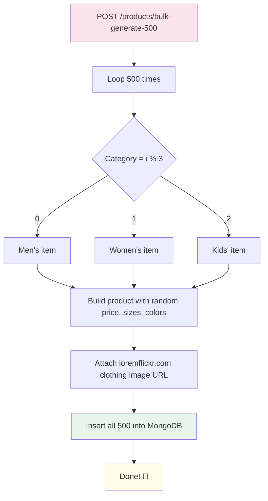

# Product Routes (products.py)

## Purpose

Manages all product-related operations: adding, viewing, updating, deleting, and bulk-generating demo products.

## What It Does

1. **Add Product** — Creates a new product with image upload
2. **Get Products** — Retrieves products filtered by category and/or price range
3. **Update Product** — Modifies an existing product's fields
4. **Delete Product** — Removes a single product from the database
5. **Bulk Generate 500** — 🚀 Auto-generates 500 realistic demo products for all 3 categories

## Endpoints

| Method | Path | Description |
|--------|------|-------------|
| POST | `/products` | Add a new product |
| GET | `/products` | Get products (optional filters) |
| PUT | `/products/{id}` | Update a product |
| DELETE | `/products/{id}` | Delete a product |
| DELETE | `/products` | Delete all products |
| POST | `/products/bulk` | Add multiple products at once |
| POST | `/products/bulk-generate-500` | 🚀 Generate 500 demo products instantly |

## Filtering

`GET /products` supports three optional query params:

| Param | Type | Example | Description |
|-------|------|---------|-------------|
| `category` | string | `men` | Filter by category (men, women, kids) |
| `min_price` | int | `500` | Minimum price in ₹ |
| `max_price` | int | `2000` | Maximum price in ₹ |

**Examples:**
- `GET /products?category=women` → all women's products
- `GET /products?max_price=1000` → all products under ₹1000
- `GET /products?category=men&max_price=2000` → men's products under ₹2000

## 🚀 Bulk Demo Product Generator

**Endpoint:** `POST /products/bulk-generate-500`

Think of this as a **factory machine** that instantly produces 500 fully-formed clothing items and loads them straight into the database — no manual effort needed!

### How it works

### What gets generated

| Category | Item Types | Count |
|----------|-----------|-------|
| **Men** | Shirt, T-Shirt, Jeans, Chinos, Blazer, Jacket, Polo, Sweater, Hoodie, Shorts | ~167 |
| **Women** | Dress, Kurti, Saree, Lehenga, Blouse, Top, Skirt, Palazzo, Jumpsuit, Cardigan | ~167 |
| **Kids** | T-Shirt, Frock, Dungaree, Shorts, Jacket, Pajama, Romper, Hoodie, Sweater, Shirt | ~166 |

- **Names**: Consistent → `"{Adjective} {Color} {Item}"` e.g. "Classic Navy Blue Jeans"
- **Prices**: Random between ₹299 – ₹7999
- **Images**: Real fashion photos from `loremflickr.com` with category-specific keywords (e.g. `menswear`, `dress`, `kids+fashion`)
- **Sizes**: Random 2–4 from: S, M, L, XL, XXL
- **Ratings & Reviews**: Randomized realistic values

> [!NOTE]
> Products use direct image **URLs** (not Base64), so no database bloat! Images load directly from loremflickr.com at display time.

## Image Handling

The system supports two image types transparently:

| Type | How stored | Example |
|------|-----------|---------|
| **Uploaded image** | Base64 in MongoDB | `data:image/jpeg;base64,...` |
| **URL image** (bulk gen) | Direct URL string | `https://loremflickr.com/400/500/menswear?lock=1001` |

The backend detects which type and serves it correctly to the frontend automatically.
