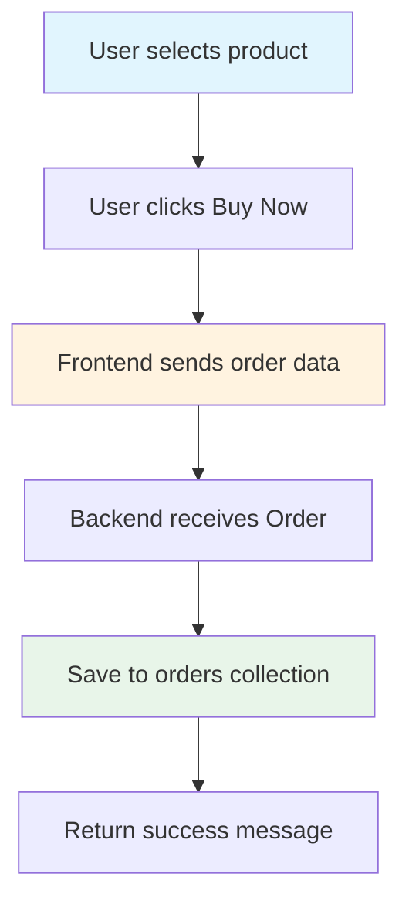

# Order Routes (orders.py)

## Purpose

Handles order placement and processing.

## What It Does

1. **Place Order** - Creates a new order record in the database

## Endpoints

| Method | Path | Description |
|--------|------|-------------|
| POST | `/orders` | Create a new order |

## Order Structure

```python
class Order(BaseModel):
    user_email: str   # Email of the customer
    product_name: str # Name of the product ordered
    quantity: int     # Number of items ordered
```

## Order Flow



## Current Implementation Notes

- Simple implementation - stores orders directly
- No order status tracking yet
- No payment processing integration
- No order confirmation email
