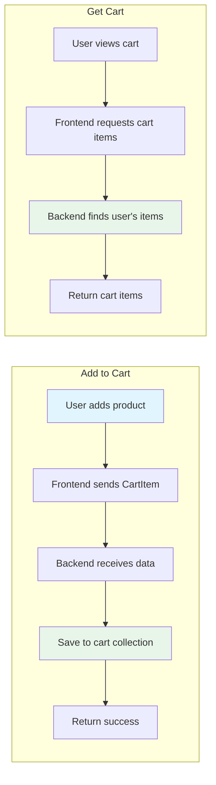

# Cart Routes (cart.py)

## Purpose

Manages the shopping cart functionality.

## What It Does

1. **Add to Cart** - Adds an item to the user's shopping cart
2. **Get Cart** - Retrieves all items in a user's cart

## Endpoints

| Method | Path | Description |
|--------|------|-------------|
| POST | `/cart/add` | Add item to cart |
| GET | `/cart/{user_email}` | Get all cart items for a user |

## CartItem Structure

```python
class CartItem(BaseModel):
    user_email: str    # Email of the user
    product_name: str # Name of the product
    quantity: int     # Number of items
```

## Cart Operations Flow



## Current Features

- Simple cart storage (no quantities update for same product)
- Each cart item is stored as a separate document
- Retrieved by user email for personalized cart
