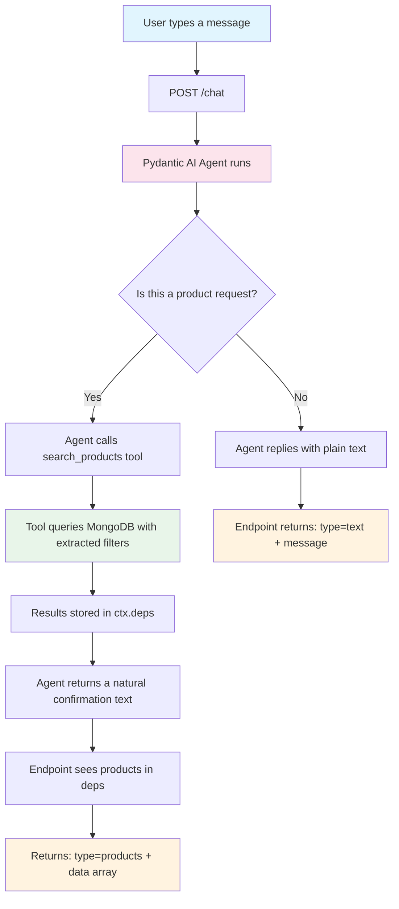

# Chatbot Routes (chatbot.py)

## Purpose

Provides a **Text2NoSQL** AI shopping assistant powered by **Pydantic AI**. The user types natural language — the AI understands intent and automatically queries MongoDB to return real, live products from the database.

## The Core Idea: Text2NoSQL

**Text2NoSQL** means converting plain English into a database query automatically.

**Analogy:** Imagine you walk into a store and say *"I want jeans under ₹1500"*. A normal button-only interface would need you to click "Men", then set a slider to ₹1500 yourself. The AI assistant is like a **personal shopper** — you just speak naturally, and they run to the right shelf, check the price tags, and bring back exactly what you asked for.

```
You: "show me women's kurtas under 1000"
  ↓
AI understands: category=women, keyword=Kurti, max_price=1000
  ↓
Tool queries MongoDB: { category: "women", name: /Kurti/i, price: { $lte: 1000 } }
  ↓
Frontend receives: product cards rendered automatically
```

No manual dropdown selection. No clicking through filters. Just natural conversation.

## Endpoint

| Method | Path | Description |
|--------|------|-------------|
| POST | `/chat` | Send a message, get text reply or product results |

## How It Works Internally



## The search_products Tool

The AI agent has one tool it can call autonomously: `search_products`.

| Parameter | Type | Description |
|-----------|------|-------------|
| `category` | string | `"men"`, `"women"`, or `"kids"` |
| `keyword` | string | Item type (e.g. `"jeans"`, `"kurti"`, `"dress"`) |
| `max_price` | int | Maximum price in ₹ |
| `min_price` | int | Minimum price in ₹ |

All parameters are **optional** — the AI extracts only the ones mentioned by the user.

## Example Conversations

| User says | What AI does | Response type |
|-----------|-------------|---------------|
| `"hey, who are you?"` | Replies warmly as shopping assistant | `text` |
| `"show me jeans"` | Calls tool with `keyword="Jeans"` | `products` |
| `"women's products under 1500"` | Calls tool with `category="women", max_price=1500` | `products` |
| `"kids hoodie"` | Calls tool with `category="kids", keyword="Hoodie"` | `products` |
| `"what's the weather today?"` | Refuses politely, gives customer care number | `text` |

## Customer Care Fallback

If the user asks something completely unrelated to shopping, the agent always replies:

> *"Sorry, I can't help with that. For assistance, contact our customer care at 546464434."*

## Technology Used

- **Pydantic AI**: Agent framework — handles tool registration, intent detection, and async execution
- **Groq API (Qwen model)**: The LLM powering reasoning and natural language understanding
- **`ctx.deps` pattern**: Products are stored in run dependencies (not in the LLM output) making it more reliable — the LLM only produces a plain string reply, the tool writes results to a side-channel
