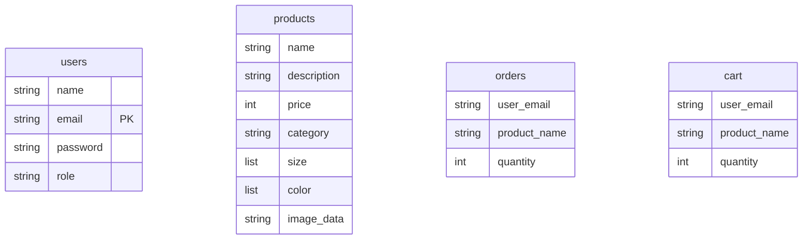

# Database Setup (database.py)

## Purpose

Establishes connection to MongoDB and initializes database collections.

## What It Does

1. **Loads Environment Variables** - Reads MongoDB URI from .env file
2. **Creates MongoDB Client** - Connects to MongoDB server
3. **Initializes Database** - Creates/selects the ecommerce_db database
4. **Defines Collections** - Sets up collections for different data types

## Implementation

```python
# Load environment variables
load_dotenv()
MONGO_URI = os.getenv("MONGO_URI")

# Connect to MongoDB
client = MongoClient(MONGO_URI)
db = client["ecommerce_db"]

# Define collections
users_collection = db["users"]
products_collection = db["products"]
orders_collection = db["orders"]
cart_collection = db["cart"]
```

## Collections Overview



## Collection Details

| Collection | Purpose | Example Fields |
|------------|---------|----------------|
| `users` | Store user accounts | name, email, password, role |
| `products` | Store product catalog | name, description, price, category, image |
| `orders` | Store order records | user_email, product_name, quantity |
| `cart` | Store shopping cart items | user_email, product_name, quantity |

## Environment Variables Required

Create a `.env` file in the backend directory:

```
MONGO_URI=your_mongodb_connection_string
```

## MongoDB Structure

```
ecommerce_db/
├── users       (table for user accounts)
├── products    (table for products)
├── orders      (table for orders)
└── cart        (table for cart items)
```
