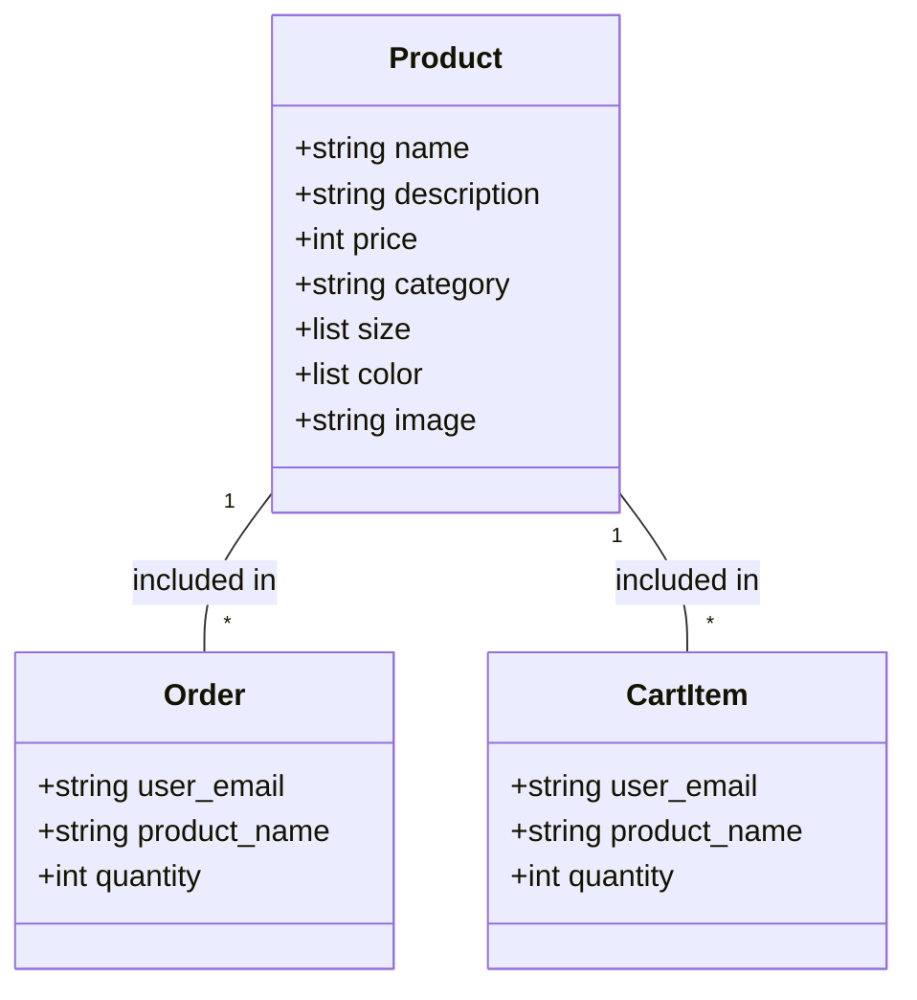

# Data Models (models.py)

## Purpose

Defines the data structures (models) used throughout the application. These use Pydantic for validation.

## Available Models

### 1. Product Model

Represents a product in the store.

```python
class Product(BaseModel):
    name: str          # Product name
    description: str   # Product description
    price: int         # Product price in Rupees
    category: str      # Category (men, women, kids)
    size: List[str]   # Available sizes
    color: List[str]  # Available colors
    image: str        # Image URL or filename
```

### 2. Order Model

Represents a purchase order.

```python
class Order(BaseModel):
    user_email: str    # Customer's email (as guest)
    product_name: str # Product ordered
    quantity: int     # Quantity ordered
```

### 3. CartItem Model

Represents an item in the shopping cart.

```python
class CartItem(BaseModel):
    user_email: str    # Customer's email (as guest identifier)
    product_name: str # Product name
    quantity: int     # Number of items
```

## Model Relationships



## Field Types Explained

| Type | Example | Description |
|------|---------|-------------|
| `str` | "John" | Text data |
| `int` | 1500 | Whole numbers |
| `List[str]` | ["S", "M", "L"] | Multiple text values |

## Validation

Pydantic validates the data:
- Required fields must be present
- Types must match (int must be a number)
- Default values are applied when not specified
