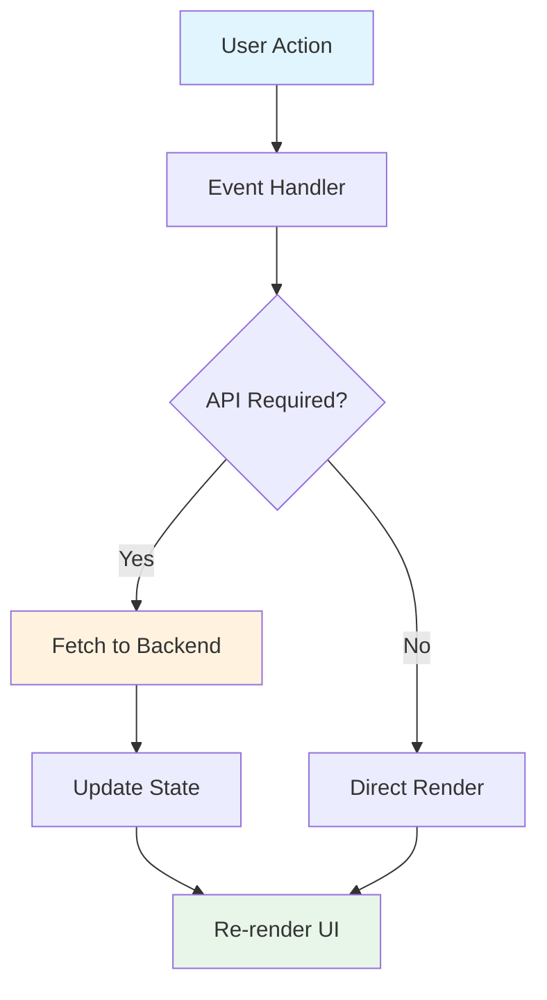

# Application Entry (main.js)

## Purpose

This is the main JavaScript file that runs the entire frontend application. It handles routing, rendering, and user interactions.

## Key Components

### 1. State Management

```javascript
let cartItemCount = 0;      // Number of items in cart
let user = null;            // Current logged-in user
let chatOpen = false;       // Chatbot visibility
let products = [];          // Product list
let currentCategory = '';   // Selected category filter
```

### 2. Routing

The app uses hash-based routing:

```javascript
function router() {
  const hash = window.location.hash || '#/';
  const path = hash.slice(1);
  
  if (path === '/login') renderLogin();
  else if (path === '/register') renderRegister();
  else if (path === '/admin') renderAdmin();
  else if (path.startsWith('/product/')) renderProductDetail(id);
  else renderHome();
}
```

### Routes

| Path | Page |
|------|------|
| `#/login` | Login/Register |
| `#/register` | Register |
| `#/admin` | Admin Dashboard |
| `#/product/{id}` | Product Detail |
| `#/` or any | Home |

### 3. Page Rendering Functions

| Function | Purpose |
|----------|---------|
| `renderHeader()` | Renders navigation bar |
| `renderHero()` | Renders hero section |
| `renderHome()` | Renders product grid |
| `renderLogin()` | Renders login/register form |
| `renderProductDetail()` | Renders single product view |
| `renderAdmin()` | Renders admin dashboard |
| `renderChatbot()` | Renders AI chatbot |

### 4. API Communication

```javascript
const API_BASE = 'http://127.0.0.1:8000';

// Example API call
const res = await fetch(`${API_BASE}/products`);
const data = await res.json();
```

### 5. User Authentication

```javascript
function getUser() {
  const storedUser = localStorage.getItem('user');
  if (storedUser) {
    return JSON.parse(storedUser);
  }
  return null;
}
```

User data is stored in localStorage after login, including role (user or admin).

### 6. Event Handlers

| Function | Purpose |
|----------|---------|
| `handleLogin()` | Process login request |
| `handleRegister()` | Process registration |
| `handleLogout()` | Clear session |
| `handleAddProduct()` | Add new product |
| `handleChatSend()` | Send chatbot message |

### 7. Data Flow



## Application Flow

1. **Page Load** - Check localStorage for user
2. **Route** - Navigate based on hash
3. **Render** - Display appropriate page
4. **Interact** - User clicks buttons
5. **API Call** - Send request to backend
6. **Update** - Refresh UI with new data
