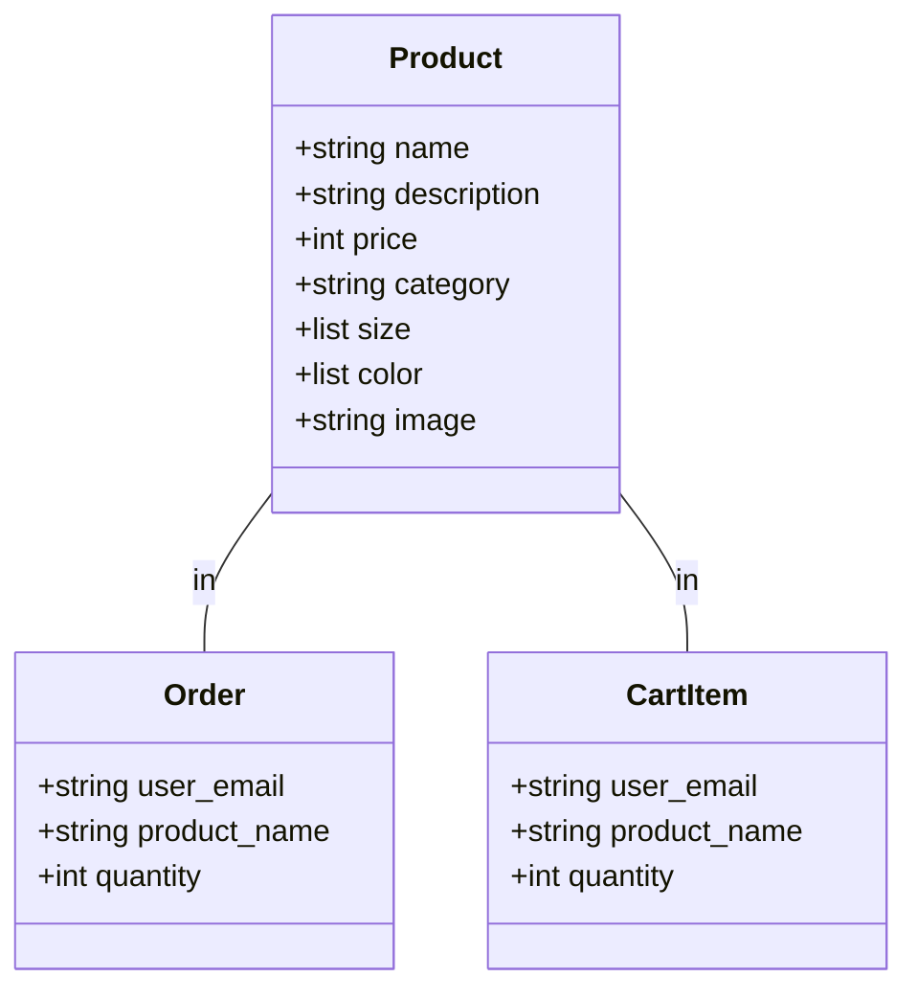
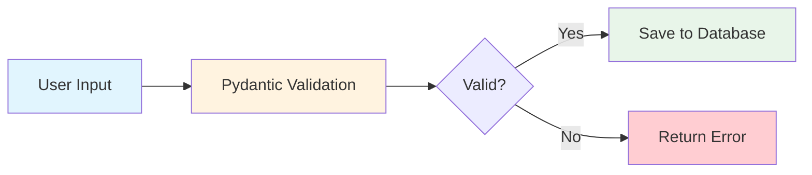

# Data Models

## Purpose

Data models define the structure of data used in the application. They ensure data consistency and provide validation via Pydantic.

## Models File Location

`backend/models.py`

## Available Models

### Product Model

Represents a product in the store.

```python
class Product(BaseModel):
    name: str        # Product name
    description: str # Product details
    price: int       # Price in rupees
    category: str   # men, women, or kids
    size: List[str] # Available sizes
    color: List[str]# Available colors
    image: str      # Image URL or filename
```

**Example:**
```json
{
  "name": "Classic White Shirt",
  "description": "Premium cotton formal shirt",
  "price": 1500,
  "category": "men",
  "size": ["S", "M", "L", "XL"],
  "color": ["White"],
  "image": "shirt.jpg"
}
```

---

### Order Model

Records a purchase transaction. Customer emails are handled as guest identifiers.

```python
class Order(BaseModel):
    user_email: str    # Customer email
    product_name: str # What was ordered
    quantity: int     # How many
```

**Example:**
```json
{
  "user_email": "john@example.com",
  "product_name": "Classic White Shirt",
  "quantity": 2
}
```

---

### CartItem Model

An item in the shopping cart.

```python
class CartItem(BaseModel):
    user_email: str    # Identifier for the cart owner
    product_name: str # Product to buy
    quantity: int     # How many
```

**Example:**
```json
{
  "user_email": "john@example.com",
  "product_name": "Classic White Shirt",
  "quantity": 1
}
```

## Model Diagram



## Data Flow



## Key Points

- **Pydantic**: Validates data types automatically
- **Type Hints**: Python type hints help catch errors early
- **List Types**: Arrays are defined with `List[str]`
