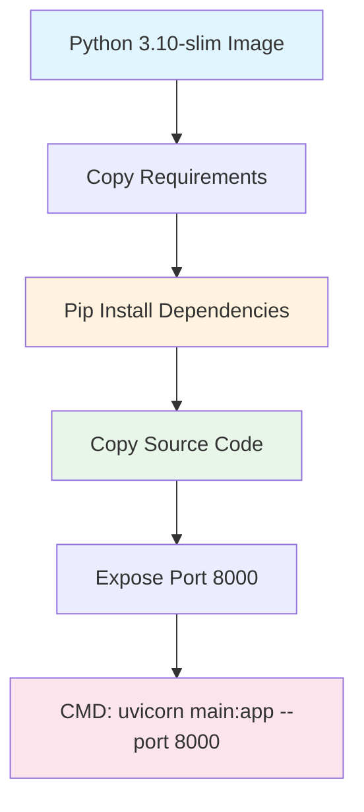
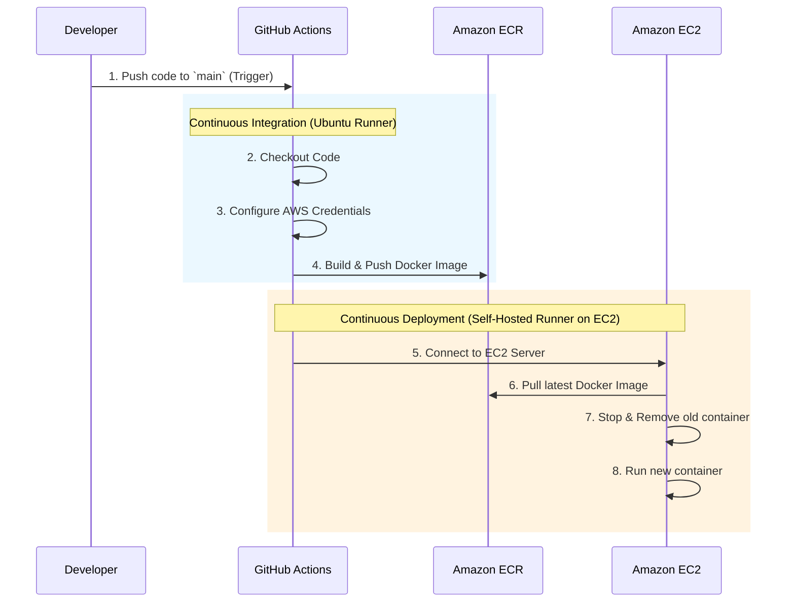

# Deployment Guide

## Purpose

This document explains how the ClothStore application is deployed using **Docker**, **GitHub Actions (CI/CD)**, and **Amazon Web Services (AWS)**. 

Because we use a unified Vanilla JS + FastAPI architecture, the deployment process is extremely lightweight. The backend natively serves the frontend files without requiring complex multi-stage node builds.

## Technology Stack

| Technology | Role |
|------------|------|
| **Docker** | Containerizes the app so it runs identically everywhere. |
| **GitHub Actions**| The CI/CD pipeline that automatically builds and deploys code when you push to the `main` branch. |
| **Amazon ECR** | Elastic Container Registry. Think of it as a secure, private "Docker Hub" on AWS where we store our built images. |
| **Amazon EC2** | Elastic Compute Cloud. The physical/virtual server running in the cloud where the Docker container actually lives and serves users. |

---

## 1. Local Development (Ports)

Locally, the application runs on **Port 8000**.

```bash
uvicorn main:app --host 0.0.0.0 --port 8000
```

---

## 2. Docker Architecture

The `Dockerfile` is extremely simplified. It pulls Python, installs `requirements.txt`, copies the backend + frontend files, and starts Uvicorn.



---

## 3. CI/CD Pipeline (GitHub Actions)

The deployment pipeline (`.github/workflows/cicd.yaml`) is fully automated. Whenever a developer pushes code to the `main` branch, GitHub Actions takes over.

### Pipeline Flow Diagram



### Environment Variables Injected During Deployment

When the EC2 server runs the new container (Step 8), it automatically injects your secret API keys from GitHub Secrets into the Docker container. 

The `docker run` command explicitly passes these in:

| Secret | Purpose |
|--------|---------|
| `MONGO_URI` | The connection string for the remote MongoDB Atlas database. |
| `GROQ_API_KEY` | Provides access to the Qwen Large Language Model for the AI Chatbot. |
| `LOGFIRE_API_KEY` | Allows the Pydantic Logfire system to capture and send observability data. |
| `TAVILY_API_KEY` | API key for the AI web-search fallback (if used). |

_Note: The application internally exposes port **8000** and binds it directly to port **8000** on the EC2 host (`-p 8000:8000`)._
